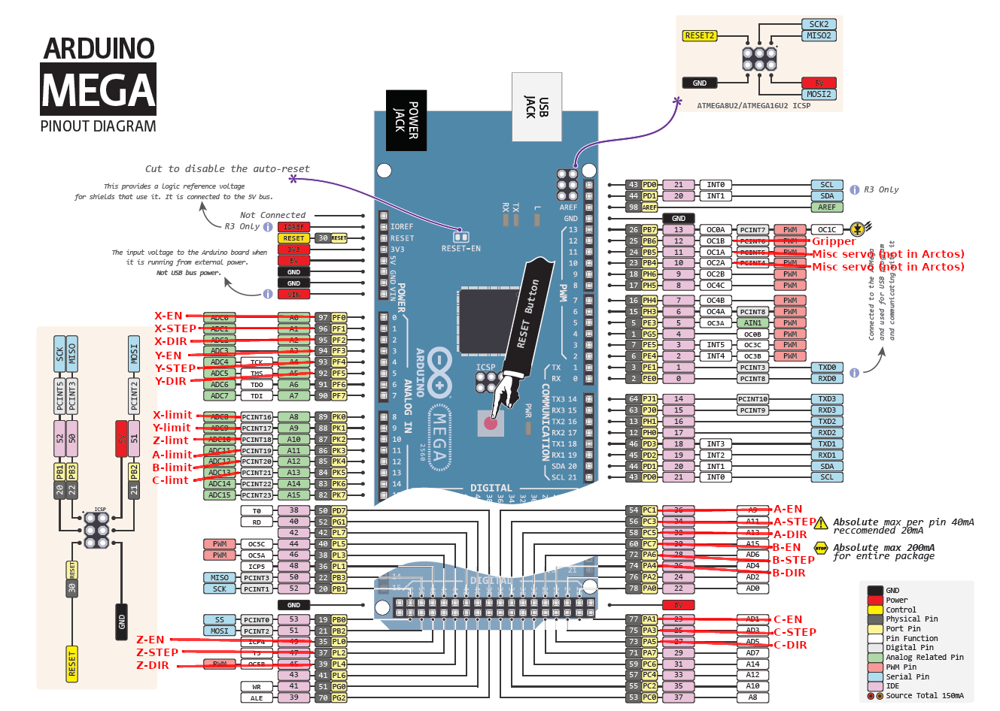

# Disclaimer

This guide is a work in progress and is an experimental alternative to the GRBL controller for the Arctos.
It solves a few problems:
* The Arcots GRBL fork as currently documented isn't set up for the limit switches.
* The Arctos GRBL fork software's 'homing' system is unstable and has had numerous reports of crashes and unstable behaviour.

This is an early draft and has only been bench tested with the Mega and motors, but has not (yet) been fully realized
on a fully built Arctos.  I am hoping to remedy that when I've finished construction of the rest of the bot.

Your mileage may vary and if you decide to use it at this stage, you should be prepared to help with the debugging and shakedown of the settings and raise a PR to this repo to help fix them.

# Pinout

This section describes the pin connections for this configuration specific to the 6 axes of the Arctos arm axes and gripper:

|Signal Name|Ardino Port|Connection|Description|
|---|---|----------|-----------|
|OK X-EN|PF0|No Connection|This is reserved for future use if, ideally, the XYZ Axes enable bits can be wired separately.  The CNC Shield does not permit individual control of the EN bit, so this is No Connect.
|OK X-STEP|PF1|CNC Shield #1 XSTEP|Step the X axis|
|NO X-DIR|PF2|CNC Shield #1 XDIR|Direction of X axis movement|
|OK Y-EN|PF3|No Connection|This is reserved for future use if, ideally, the XYZ Axes enable bits can be wired separately.  The CNC Shield does not permit individual control of the EN bit, so this is No Connect.
|OK Y-STEP|PF4|CNC Shield #1 YSTEP|Step the Y axis|
|NO Y-DIR|PF5|CNC Shield #1 YDIR|Direction of Y axis movement|
|OK Z-EN|PL0|No Connection|This is reserved for future use if, ideally, the XYZ Axes enable bits can be wired separately.  The CNC Shield does not permit individual control of the EN bit, so this is No Connect.
|OK Z-STEP|PL2|CNC Shield #1 ZSTEP|Step the Z axis|
|NO Z-DIR|PL4|CNC Shield #1 ZDIR|Direction of Z axis movement|
|OK X-LIMIT|PK0(PCINT16)|X Limit Switch "Red" wire|Limit switch for X axis. Limit switch black pin goes to GND|
|OK Y-LIMIT|PK1(PCINT17)|Y Limit Switch "Red" wire|Limit switch for Y axis. Limit switch black pin goes to GND|
|OK Z-LIMIT|PK2(PCINT18)|Z Limit Switch "Red" wire|Limit switch for Z axis. Limit switch black pin goes to GND|
|OK A-LIMIT|PK3(PCINT19)|A Limit switch "Red" wire|Limit switch for A axis. Limit switch black pin goes to GND|
|OK B-LIMIT|PK4(PCINT20)|B Limit switch "Red" wire|Limit switch for C axis. Limit switch black pin goes to GND|
|OK C-LIMIT|PK5(PCINT21)|C Limit switch "Red" wire|Limit switch for C axis. Limit switch black pin goes to GND|
|OK A-EN|PC1|No Connection|This is reserved for future use if, ideally, the XYZ Axes enable bits can be wired separately.  The CNC Shield does not permit individual control of the EN bit, so this is No Connect.
|OK A-STEP|PC3|CNC Shield #2 XSTEP|Step the A axis|
|NO A-DIR|PC5|CNC Shield #2 XDIR|Direction of A axis movement|
|OK B-EN|PC7|No Connection|This is reserved for future use if, ideally, the XYZ Axes enable bits can be wired separately.  The CNC Shield does not permit individual control of the EN bit, so this is No Connect.
|B-STEP|PA6|CNC Shield #2 YSTEP|Step the B axis|
|NO B-DIR|PA4|CNC Shield #2 YDIR|Direction of B axis movement|
|C-EN|PA1|No Connection|This is reserved for future use if, ideally, the XYZ Axes enable bits can be wired separately.  The CNC Shield does not permit individual control of the EN bit, so this is No Connect.
|C-STEP|PA3|CNC Shield #2 ZSTEP|Step the C axis|
|NO C-DIR|PA5|CNC Shield #2 ZDIR|Direction of C axis movement|
|GRIPPER|PB6|Gripper Servo PWM signal|Servo PWM Signal for Arctos Gripper or other end-effector.|
|SERVO1|PB5|No Connection|This is reserved for future use in the event another servo were used, for example, as a 'tool' on the Arctos as an alternate end-effector.|
|SERVO2|PB4|No Connection|This is reserved for future use in the event another servo were used, for example, as a 'tool' on the Arctos as an alternate end-effector.|
|+5V|+5V|CNC Shield #1 +5V|5V signal reference for CNC Shield|
|GND|GND|CNC Shield #1 GND|GND signal reference for CNC Shield|
|+5V|+5V|CNC Shield #2 +5V|5V signal reference for CNC Shield|
|GND|GND|CNC Shield #2 GND|GND signal reference for CNC Shield|

Also be sure to shunt the CNC Shield GND to EN pin for both CNC Shields in order to enable them.




# Flashing uCNC for your Arctos robot arm:
Flashing uCNC firmware to an Arduino Mega is a process that involves uploading new software to the microcontroller on the board. In order to do this, you’ll need a few things:

    This repository checked out to your computer
    An Arduino MEGA 2560
    A USB cable to connect the board to your computer
    The uCNC firmware which is in this repository.
    The Arduino IDE software (which can be downloaded from the official Arduino website)

Once you have these things, you can follow the steps below to flash the uCNC firmware to your Arduino:

* Step 1: Install the Arduino IDE Software Download the Arduino IDE software and install it on your computer. Once the installation is complete, open the Arduino IDE.

* Step 2: Connect the Arduino Board Connect your Arduino board to your computer using the USB cable.

* Step 3: Select the Arduino Board Type In the Arduino IDE, go to the “Tools” menu and select “Board.” Choose the Arduino Mega for the pinouts described here.

* Step 4: Select the Serial Port In the same “Tools” menu, select “Port” and choose the serial port that your Arduino board is connected to. If you’re not sure which port to select, you can check the “Device Manager” on your computer to see which port the Arduino board is using.

* Step 5: Configure uCNC for the Arctos robot.  Copy the settings .h files to the 'uCNC' directory.
```
cp docs/arctos/boardmap_reset.h uCNC/
cp docs/arctos/boardmap_overrides.h uCNC/
cp docs/arctos/cnc_hal_reset.h uCNC/
cp docs/arctos/cnc_hal_overrides.h uCNC/
cp docs/arctos/cnc_config.h uCNC/
cp 
```

There is also a 'ucnc_build.json' you can use with the uCNC [configuration tool](https://paciente8159.github.io/uCNC-config-builder/) to alter the pinouts.  Note, however, the configuration builder has several bugs, so be sure to double-check it before proceeding with changes.

* Step 6: Open the uCNC.ino file in the Arduino IDE

* Step 7: Upload the sketch (->) Arrow Button.

* Step 8: Modify the settings as below in the Serial console.  

# uCNC settings
These settings are default and should work, but are not optimal in any sense.

```
$0 = 33.334 (Step pulse time, microseconds)
$1 = 255 (Step idle delay, milliseconds)
$2 = 0 (Step pulse invert, mask)
$3 = 0 (Step direction invert, mask)
$4 = 0 (Invert step enable pin, boolean)
$5 = 255 (Invert limit pins, boolean)
$6 = 0 (Invert probe pin, boolean)
$10 = 0 (Status report options, mask)
$11 = 0.010 (Junction deviation, millimeters)
$12 = 0.002 (Arc tolerance, millimeters)
$13 = 0 (Report in inches, boolean)
$20 = 0 (Soft limits enable, boolean)
$21 = 1 (Hard limits enable, boolean)
$22 = 1 (Homing cycle enable, boolean)
$23 = 0 (Homing direction invert, mask)
$24 = 400.000 (Homing locate feed rate, mm/min)
$25 = 400.000 (Homing search seek rate, mm/min)
$26 = 250 (Homing switch debounce delay, milliseconds)
$27 = 10.0 (Homing switch pull-off distance, millimeters)
$30 = 0 (Maximum spindle speed, RPM)
$31 = 5 (Minimum spindle speed, RPM)
$32 = 0 (Laser-mode enable, boolean)
$81 = 0 (Tool - unused)
$100 = 120.000 (X-axis travel resolution, step/mm)
$101 = 576.000 (Y-axis travel resolution, step/mm)
$102 = 450.000 (Z-axis travel resolution, step/mm)
$103 = 120.000 (A-axis travel resolution, step/mm)
$104 = 120.000 (B-axis travel resolution, step/mm)
$105 = 120.000 (C-azis travel resolution, step/mm)
$110 = 7000.000 (X-axis maximum rate, mm/min)
$111 = 900.000 (Y-axis maximum rate, mm/min)
$112 = 9000.000 (Z-axis maximum rate, mm/min)
$113 = 9000.000 (A-axis maximum rate mm/min)
$114 = 9000.000 (B-axis maximum rate mm/min)
$115 = 9000.000 (C-axis maximum rate mm/min)
$120 = 50.000 (X-axis acceleration, mm/sec^2)
$121 = 150.000 (Y-axis acceleration, mm/sec^2)
$122 = 150.000 (Z-axis acceleration, mm/sec^2)
$123 = 150.000 (A-axis acceleration, mm/sec^2)
$124 = 150.000 (B-axis acceleration, mm/sec^2)
$125 = 150.000 (C-axis acceleration, mm/sec^2)
$130 = 150.000 (X-axis maximum travel, millimeters)
$131 = 200.000 (Y-axis maximum travel, millimeters)
$132 = 150.000 (Z-axis maximum travel, millimeters)
$133 = 800.000 (A-axis maximum travel, millimeters)
$134 = 800.000 (B-axis maximum travel, millimeters)
$135 = 800.000 (C-axis maximum travel, millimeters)
```

# Setting scratch

200 steps/mm * 0.10 mm/deg = 20 steps/deg
= 200 steps/360 degrees
= 2000 steps / 3600 degrees
3600mm/min = 60deg/sec


